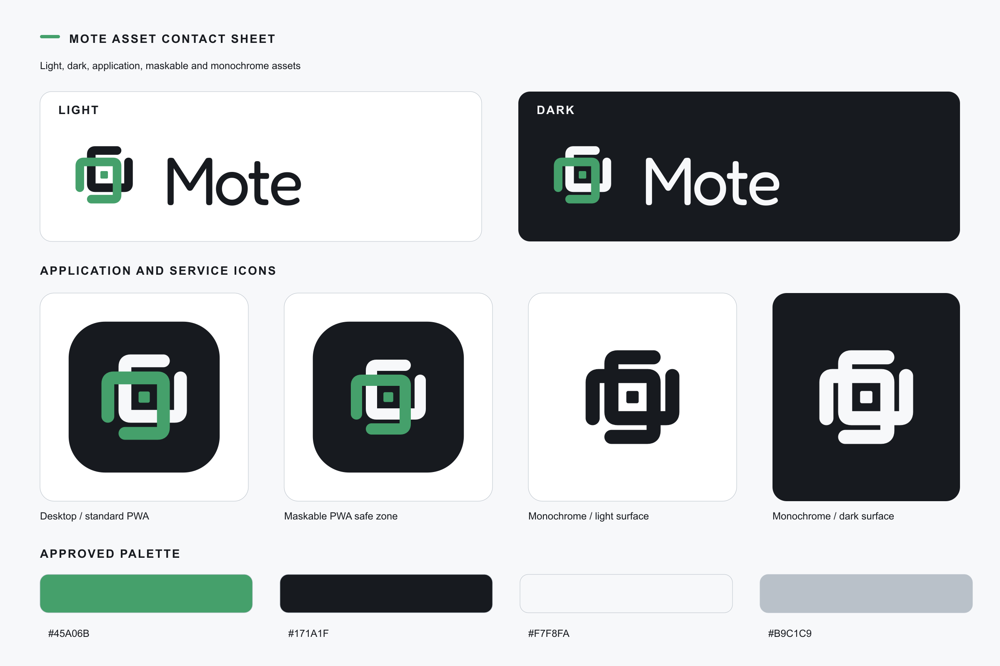

# Mote brand assets

Mote uses a pair of equal overlapping photo frames with opposing crop corners, Fredoka, and a single green highlight. The identity is built around clean, efficient simplicity.



## Quick picks

| Use | Preferred file |
| --- | --- |
| Editable symbol master | [`source/mote-symbol-master.svg`](source/mote-symbol-master.svg) |
| Portable horizontal logo on a light surface | [`svg/mote-lockup-horizontal-light.svg`](svg/mote-lockup-horizontal-light.svg) |
| Portable horizontal logo on a dark surface | [`svg/mote-lockup-horizontal-dark.svg`](svg/mote-lockup-horizontal-dark.svg) |
| Standalone light-surface symbol | [`svg/mote-symbol-light.svg`](svg/mote-symbol-light.svg) |
| Standalone dark-surface symbol | [`svg/mote-symbol-dark.svg`](svg/mote-symbol-dark.svg) |
| macOS application | [`icons/macos/Mote.icns`](icons/macos/Mote.icns) |
| Windows application | [`icons/windows/Mote.ico`](icons/windows/Mote.ico) |
| Linux application | [`icons/linux/hicolor/`](icons/linux/hicolor/) |
| Browser favicon | [`icons/web/favicon.svg`](icons/web/favicon.svg) or [`icons/web/favicon.ico`](icons/web/favicon.ico) |
| Standard PWA icon | [`icons/web/icon-512.png`](icons/web/icon-512.png) |
| Maskable PWA icon | [`icons/web/maskable-512.png`](icons/web/maskable-512.png) |
| Hosted-service monochrome mark | [`icons/web/service-monochrome.svg`](icons/web/service-monochrome.svg) |
| Print and documentation | [`print/mote-lockup-light.svg`](print/mote-lockup-light.svg) |
| One-page brand reference | [`print/mote-brand-sheet-a4.pdf`](print/mote-brand-sheet-a4.pdf) |

The desktop packages all use the same symbol. Their differences are limited to required file formats, sizes, canvas padding, and small-size optical correction.

## Identity

| Role | Value |
| --- | --- |
| Mote green | `#45A06B` |
| Graphite | `#171A1F` |
| Cool white | `#F7F8FA` |
| Mineral grey | `#B9C1C9` |
| Wordmark | Fredoka Regular 400, width axis 96% |
| Brand line | A simple space for your photos. |

The wordmark and lockup SVGs contain vector outlines. They do not depend on a locally installed font. Use the bundled variable font only when the text must remain editable.

## Light mode and dark mode

On light surfaces, use files ending in `-light`. These use graphite text and a graphite rear frame behind the green foreground frame.

On dark surfaces, use files ending in `-dark`. These reverse the wordmark and rear frame to cool white. Mote green stays `#45A06B` in both appearances.

Use the graphite monochrome symbol on a light surface and the white monochrome symbol on a dark surface. The full-colour application icon keeps its graphite tile, cool-white rear frame, and green foreground frame across macOS, Windows, Linux, and the PWA so it remains recognisable between platforms.

## Logo rules

- Keep both frames, their offsets, and the green foreground unchanged.
- Keep the rear frame open at the top-right and the foreground frame open at the bottom-left.
- Keep the centre dot inside the shared open area without touching either frame.
- Do not add the wordmark or other text inside an application icon.
- Leave clear space equal to at least one centre-square width around the symbol or horizontal lockup.
- Do not place the graphite wordmark on graphite, or the white wordmark on white.
- Keep both frames and their crop openings at small sizes. The 16 px and 24 px exports use a slightly heavier optical master with wider corner openings.
- Use the outlined SVG wordmark for portable documents.

Minimum sizes are 16 px for the standalone screen symbol and 6 mm for print. Use a horizontal lockup at 120 px or wider when the wordmark must remain readable.

## Platform packages

### macOS

`icons/macos/Mote.iconset/` contains the ten standard 1x and 2x PNG files. `Mote.icns` packages the same representations. `icon-1024-dark.png` is an appearance-specific source for a future asset catalog; the default ICNS remains the full-colour graphite-tile icon.

For Tauri, copy the ICNS into the shipping icon directory during a separate integration change, then reference it from `bundle.icon`. This asset task does not replace the current shipping icon.

### Windows

`icons/windows/Mote.ico` contains 16, 24, 32, 48, 64, 128, and 256 px, 32-bit entries with alpha. Individual PNG sources are in `icons/windows/png/`.

### Linux

Copy the `hicolor` contents into the matching installation prefix:

```bash
cp -R docs/brand/icons/linux/hicolor/* /usr/share/icons/hicolor/
```

The full-colour `mote.svg` and PNG files are the primary application icons. `mote-symbolic.svg` and `mote-symbolic-dark.svg` are optional theme-aware assets.

### Hosted web and PWA

Add the favicon and touch icon to the document head:

```html
<link rel="icon" href="/icons/favicon.svg" type="image/svg+xml">
<link rel="icon" href="/icons/favicon.ico" sizes="any">
<link rel="apple-touch-icon" href="/icons/apple-touch-icon-180.png">
```

Use [`icons/web/manifest-icons.json`](icons/web/manifest-icons.json) as the manifest fragment:

```json
{
  "icons": [
    { "src": "icon-192.png", "sizes": "192x192", "type": "image/png", "purpose": "any" },
    { "src": "icon-512.png", "sizes": "512x512", "type": "image/png", "purpose": "any" },
    { "src": "maskable-192.png", "sizes": "192x192", "type": "image/png", "purpose": "maskable" },
    { "src": "maskable-512.png", "sizes": "512x512", "type": "image/png", "purpose": "maskable" },
    { "src": "service-monochrome.svg", "sizes": "any", "type": "image/svg+xml", "purpose": "monochrome" }
  ]
}
```

The hosted-service icon is the Mote symbol. It does not add cloud, server, globe, or network imagery.

## Font licence

Fredoka is bundled under the SIL Open Font License 1.1. Keep [`fonts/OFL.txt`](fonts/OFL.txt) with redistributed font binaries. [`fonts/README.md`](fonts/README.md) records the source, checksums, axes, and CSS.

## Print and review

- [`print/mote-lockup-light.svg`](print/mote-lockup-light.svg) and [`print/mote-lockup-dark.svg`](print/mote-lockup-dark.svg) are the preferred scalable print assets.
- The `-3000.png` files are transparent sRGB exports for documentation, release pages, and presentations.
- [`print/mote-brand-sheet-a4.pdf`](print/mote-brand-sheet-a4.pdf) is the printable one-page reference.
- [`previews/mote-small-size-check.png`](previews/mote-small-size-check.png) shows the 16, 24, 32, 48, and 64 px desktop icons at native size and nearest-neighbour enlargement.
- The [approved design specification](../superpowers/specs/2026-09-02-mote-brand-asset-pack-design.md) records the full asset decisions.

The older `fredoka-*.jpg` files are design-history captures from the font-selection test page. They are not production logo exports.

## Regeneration

Do not edit generated files directly. Change `tools/config.mjs` or `tools/svg.mjs`, then rebuild the pack.

```bash
npm install
python3 -m pip install -r docs/brand/tools/requirements.txt
npm run brand:generate
npm run brand:test
```

The generator accepts `BRAND_PYTHON`, `BRAND_PDFTOPPM`, and `BRAND_FONTCONFIG_FILE` when those programs or configuration files are outside the default path. It stages and validates every output before replacing `source/`, `svg/`, `fonts/`, `icons/`, `print/`, and `previews/`.
