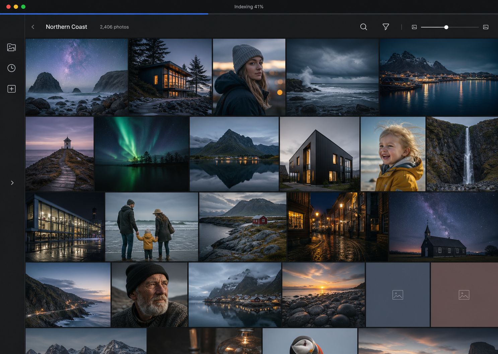

# macOS browse vertical slice

Date: 2026-08-24

Status: Approved in conversation, awaiting review of this written specification

## Summary

Build the first user-facing version of Photo Viewer as an unsigned macOS Tauri application. It opens one local or mounted folder, remembers that source, indexes it progressively, and shows real media in a fast vertical justified wall. A user can change thumbnail size, open a photo, zoom and pan it, then return to the same wall position.

The React and TypeScript interface depends on a host-neutral `PhotoService` contract. The macOS host implements that contract with typed Tauri commands, ordered channels, and a catalog-ID-based derivative protocol. The future hosted web portal will provide a second adapter through HTTP and a server event stream. React components must not import Tauri APIs or construct transport URLs.

This slice is delivered through five runnable checkpoints. Each checkpoint ends with tests and a captured demonstration from the working application.

## Relationship to the system design

This specification implements the first desktop portion of the approved [Photo Viewer system design](2026-08-21-photo-viewer-design.md). It preserves these system-wide rules:

- Source media is read-only.
- SQLite and derivatives stay on local writable storage.
- One catalog may contain multiple roots, although this slice opens one source at a time.
- Indexing emits useful results before a folder scan finishes.
- Cached catalog entries remain useful when a source is offline.
- The shared React interface must later run in the hosted web portal.

The next feature slice adds multi-folder selection. Search, advanced filters, smart collections, full video support, deep zoom, signed distribution, and the hosted web adapter remain outside this slice.

## Product outcome

A first-time user can launch a native macOS application, choose a photo folder, and begin seeing images without waiting for the complete scan. On later launches, the application restores the source and cached wall immediately, then reconciles filesystem changes in the background.

The interaction should feel quiet and direct. Photos fill the window. Navigation, indexing status, search affordance, and sizing controls occupy as little space as possible. There is no dashboard or setup wizard.

## Selected visual direction

The selected direction is Canvas First. It uses a compact collapsible rail, a charcoal dark appearance, a restrained top toolbar, and a dense justified wall. The dark rendering below is the visual target for the first implementation. The light appearance keeps the same geometry and hierarchy with lighter theme tokens.

The generated mockup guides hierarchy, spacing, density, and tone. It does not override functional requirements. In particular, the implementation uses true justified rows rather than masonry columns, accessible controls rather than unexplained icons, and stable placeholders for every unloaded image.

## Scope

### Included

- An unsigned macOS `.app` bundle and normal Tauri development build
- A first-run empty state with a native Choose Folder action
- One persistent recent source backed by the existing stable library identity model
- Progressive discovery, shape extraction, thumbnail generation, and wall updates
- A vertically scrolling justified wall
- Cursor-paged catalog queries and row virtualization
- A continuous thumbnail-size control that preserves the first visible asset
- System, Light, and Dark appearance settings, with System as the default
- Persistence of the selected source, appearance, target row height, active view, and wall anchor
- A basic immersive viewer with fit, zoom, pan, previous, next, Escape, and return to the same wall position
- Wall and viewer decoding for JPEG, PNG, TIFF, and WebP, plus usable embedded JPEG previews when present in RAW files
- Desktop control fading and a bottom reveal zone for the viewer filmstrip
- Offline, unreadable, corrupt-file, empty, and cache-failure states
- Try Again and Locate Folder recovery on macOS
- Responsive shared components and phone or tablet interface tests
- A safe developer method for starting with a separate clean local profile

### Deferred

- Selecting or combining several folders
- Filename and keyword search behavior beyond a disabled or non-primary affordance
- Rating and media-type filters
- Smart collections
- Editing source files or metadata
- Full-resolution deep-zoom tiling
- RAW development beyond the best available embedded or generated screen preview
- Native HEIC or HEIF, AVIF, and RAW decoding when no usable embedded JPEG preview exists
- Video playback beyond indexing and a poster-ready media record
- Signed and notarized builds, DMG packaging, and update delivery
- A production HTTP adapter, Docker image, and SMB Compose setup
- Final mobile viewer polish

## Delivery rule

Work proceeds in thin functional increments. A checkpoint is complete only when the macOS application runs, the new behavior is visible with real or controlled fixture media, and its relevant automated checks pass. Backend-only preparation does not count as a delivered checkpoint unless the running application uses it.

Each demonstration includes:

- The exact commit being demonstrated
- A fresh verification summary
- One or more screenshots from the running app
- A short recording when motion or responsiveness is the feature under review
- Known limitations that remain for the next checkpoint

## Architecture

### Repository units

The new code is split into four units with narrow responsibilities:

- `crates/app-service` owns host-neutral browse operations, settings, source restoration, query DTOs, scan orchestration, and derivative requests.
- `apps/interface` owns the shared React and TypeScript application, the `PhotoService` contract, responsive components, themes, and the in-memory test adapter.
- `apps/desktop/src-tauri` owns the Tauri application, native folder dialogs, command bindings, ordered channels, local directory selection, and the custom derivative protocol.
- Existing Rust crates continue to own catalog persistence, library lifecycle, indexing, metadata, and derivative-cache safety.

The existing `photo-server` crate remains a diagnostic server in this slice. It does not become the desktop transport. A later web slice will depend on `app-service` and expose the same operations through HTTP.

### Host-neutral interface

React receives one `PhotoService` instance at startup. Components do not import `@tauri-apps/*`, call `fetch`, inspect hostnames, or handle native paths.

The initial contract contains operations equivalent to:

- `getBootstrapState()`
- `chooseFolder()` as an optional desktop capability
- `retrySource(sourceId)`
- `locateSource(sourceId)` as an optional desktop capability
- `queryWall(request)`
- `requestWallDerivatives(request)`
- `getViewerAsset(request)`
- `getAdjacentAsset(request)`
- `watchProgress(listener)`
- `getSettings()`
- `updateSettings(patch)`
- `derivativeUrl(reference)`

Requests and responses use stable IDs, relative display names, cursor tokens, dimensions, media classification, representative colours, availability, and derivative references. They never contain unrestricted absolute source paths. Platform-only methods report capability availability explicitly.

The TypeScript contract has an in-memory implementation for interface tests. The desktop adapter is the only production implementation in this slice. The future web adapter maps the same methods to HTTP and server events without changing React components.

### Desktop host

The Tauri host creates one long-lived application-service state. It opens the catalog and cache during startup, repairs derivative references, restores persisted settings, and starts reconciliation only after local-state preflight succeeds.

Desktop commands are asynchronous when they can touch SQLite, scan media, or generate derivatives. Short queries return typed JSON DTOs. Ordered indexing and derivative-ready updates use a Tauri channel rather than a high-volume global event stream.

The native folder dialog runs on the Rust side. The selected path goes directly into the library service for validation and persistence. The WebView receives the resulting source ID and display name, not authority to read the selected directory.

### Derivative delivery

The desktop registers a custom read-only `photo-derivative:` protocol. A URL identifies a catalog asset, derivative class, and immutable derivative key. It never contains a source path.

The protocol handler:

1. Parses and validates the ID and derivative key.
2. Resolves the derivative through the catalog.
3. Confirms that the resolved file remains under the configured cache root.
4. Returns the image bytes with the correct content type and immutable cache headers.
5. Returns a bounded not-ready or missing response without exposing local paths.

The interface schedules missing visible and near-viewport derivatives through `PhotoService`. A derivative-ready channel update changes the immutable URL, causing the reserved tile to load and crossfade. The custom protocol never serves source media directly.

## Local persistence

The production profile uses the standard macOS application-support location for SQLite and durable settings, and the standard cache location for generated derivatives. The working application name is `Photo Viewer`; the development bundle identifier is `app.photoviewer.desktop`.

SQLite stores:

- Recent source identity and last known path
- Appearance setting
- Target wall row height
- Last active source and query
- The first visible asset ID and its offset within the viewport
- Viewer return state

System appearance is the default. Light and Dark are explicit persisted overrides. Theme selection updates both the WebView and native macOS window immediately.

Development builds accept a named local profile. A new profile receives separate data and cache directories, so first-run scenarios do not require deleting or renaming the normal catalog. The profile name is validated and never affects source paths. Release builds use the default profile.

## Startup and source flow

### First launch

1. Tauri opens a new local catalog and cache.
2. React receives an empty bootstrap state and renders the Canvas First shell with a Choose Folder action.
3. The native picker allows one directory.
4. Rust validates that the folder does not overlap local state or another configured source.
5. The folder becomes a persistent recent source.
6. Discovery begins and emits catalog rows in batches.
7. The wall renders as soon as assets with known geometry are available.

Cancelling the picker leaves the empty state intact and produces no error banner.

### Later launch

1. The cached catalog and settings open before any source scan.
2. The previous wall query and anchor render from catalog data.
3. Cached thumbnails load through the derivative protocol.
4. Source availability is checked without deleting offline records.
5. Reconciliation and background refinement start after the cached view is usable.

If the source is unavailable, the cached wall remains in place and recovery controls appear without blocking navigation.

## Wall query and layout

The wall queries SQLite only. It never enumerates the source filesystem during scrolling, resizing, or reopening.

`queryWall` uses stable cursor pagination and returns enough shape data to lay out each item before a thumbnail exists. The response includes stable asset ID, width, height, orientation, media type, representative colour, availability, warning state, and current derivative reference.

A pure TypeScript layout function groups ordered assets into justified rows for the current content width and target row height. Completed rows fill the width while preserving aspect ratios. The final incomplete row remains left aligned and does not stretch excessively.

TanStack Virtual virtualizes complete rows rather than individual photos. The wall renders the visible rows plus a measured overscan region. Asset IDs provide stable keys. Returning from the viewer restores a saved row-measurement snapshot, asset anchor, and pixel offset.

Dragging the size control recalculates rows continuously. Before recalculation, the wall records the first visible asset and its viewport offset. After recalculation, it restores that anchor. Thumbnail requests use a bounded set of size classes rather than generating one derivative for every slider position.

## Progressive thumbnail behavior

Every tile has final geometry and a representative-colour background before its image loads. Shape data therefore causes no layout shift.

Visible assets receive the highest derivative priority, followed by assets in the overscan region and then the rest of the active source. Pointer, keyboard, touch, scroll, resize, and viewer activity lower background indexing concurrency through the existing interaction-aware scheduler.

The interface batches derivative requests for a row range. It does not issue one Tauri command per image. Thumbnails decode off the UI thread. When a thumbnail becomes ready, it crossfades over 120 to 180 milliseconds unless reduced motion is active.

Fast scrolling cancels or deprioritizes work that has moved well beyond the overscan range. Already generated durable thumbnails remain available across restarts.

## Viewer behavior

Clicking an available wall item opens an edge-to-edge viewer without rebuilding the wall query. The viewer keeps the current ordered result context and requests adjacent assets by cursor or stable neighbor token rather than loading the full result set.

The first frame uses the best ready derivative. The app requests a screen preview immediately and replaces the first frame in place when it arrives. Fit, zoom, and pan state do not change during refinement.

Desktop controls behave as follows:

- Pointer movement reveals the title and essential controls.
- Moving into the bottom reveal zone shows the filmstrip.
- Controls fade after about 2.5 seconds of inactivity.
- Fade pauses while a control has focus or a menu is open.
- Left and Right move between assets, Escape returns to the wall, and standard zoom shortcuts work.
- Returning restores the same wall asset and viewport offset.

This slice may use a screen-size derivative rather than full deep-zoom tiles. Deep zoom remains a later viewer feature.

## Responsive and hosted-web constraints

The first package targets macOS, but the React components must remain suitable for the hosted web portal on phones and tablets.

- Layout responds to container width rather than desktop-only viewport assumptions.
- The navigation rail becomes a temporary drawer when space is narrow.
- Toolbar actions collapse while preserving accessible names.
- No required behavior depends on hover.
- Pointer, keyboard, and touch paths coexist in shared components.
- Touch targets use mobile-safe sizing.
- Viewer drag and pinch remain reserved for pan and zoom; one tap toggles controls.
- Shared styles honor safe-area insets and reduced motion.
- The web capability set will omit Choose Folder and Locate Folder for server paths.

Phone and tablet component tests begin in this slice. The HTTP adapter, mobile browser packaging, and final touch tuning remain part of the web delivery slice.

## Appearance

The interface uses CSS custom properties for colour, type, spacing, radii, focus rings, animation timing, and image gutters. Components consume semantic variables rather than hard-coded light or dark colours.

The Dark palette follows the selected Canvas First mockup: matte charcoal surfaces, restrained separators, high-contrast text, and a small cool-blue progress accent. The Light palette keeps the same density with warm off-white and pale-grey surfaces. System follows the macOS appearance and responds to changes while the application is running.

The UI uses the platform system font stack. A small consistent line-icon package supplies common symbols. There is no general component framework, utility-CSS framework, glass effect, dashboard card system, or decorative animation layer.

## Error and recovery states

### Unavailable source

Cached thumbnails remain in the wall with reduced saturation and contrast. A faded question mark appears in each unavailable tile, and accessible text names the state. Clicking an unavailable item opens a recovery sheet rather than the viewer.

The macOS sheet offers Try Again, Locate Folder, and the last known path. Relinking operates through the Rust library service and preserves the stable source ID only after verification.

### Online source with a missing file

The asset remains cataloged as missing. Its tile uses the unavailable treatment. Other assets continue to open and index.

### Unreadable or corrupt media

The scanner records a bounded warning and continues. If geometry is known, the wall keeps the tile with a warning state. If geometry is unavailable, the asset uses a stable fallback aspect ratio until a successful later read supplies shape data.

### Cache or derivative failure

Catalog browsing continues. The tile retains its representative-colour placeholder and exposes a retry action through its accessible context menu. A full or unwritable cache pauses new derivative work and reports one quiet source-level warning rather than repeated per-tile banners.

### Catalog startup failure

The application shows a local-state recovery screen and does not open source files. Migration rollback and backups follow the existing catalog rules. The recovery screen must never offer an action that deletes or rewrites source media.

## Performance targets

The system-wide performance targets remain in force:

- First visible cached thumbnails within 200 milliseconds after a view change
- Cached viewer preview within 300 milliseconds
- Wall scrolling and transitions targeting 60 frames per second
- No tile geometry change when image quality improves
- Interaction immediately reducing background concurrency

The slice adds these implementation checks:

- Wall queries remain cursor bounded and independent of total catalog size.
- Mounted DOM rows stay limited to the viewport and measured overscan.
- Derivative scheduling is batched by visible range.
- The wall does not perform synchronous source reads or image decoding.
- Cached launch renders before reconciliation work becomes visible.
- Thumbnail-size changes preserve the first visible asset within 8 CSS pixels of its previous viewport offset.

Profiling uses the existing synthetic million-asset catalog for query behavior and controlled media folders for rendering and derivative timing.

## Frontend stack

- React and TypeScript
- Vite for development and production bundling
- TanStack Query for cursor pages, cache lifetime, and targeted invalidation
- TanStack Virtual for vertical row virtualization and scroll restoration
- CSS Modules and semantic CSS custom properties
- A small line-icon package
- Vitest unit tests plus Vitest Browser Mode with its Playwright WebKit provider
- Testing Library and accessibility assertions

The justified-row engine remains a small project-owned pure function. No gallery component owns wall layout or styling.

## Testing

### Rust

- Host-neutral service tests for bootstrap state, settings, source restoration, wall queries, and neighbor navigation
- Tauri command tests for DTO mapping, capability boundaries, and typed errors
- Derivative protocol tests for valid IDs, malformed IDs, unknown assets, immutable keys, cache-root containment, content type, and missing files
- Integration tests for first scan, progressive results, cached restart, offline restart, relinking, corrupt files, and cache failures
- Assertions that production source operations remain read-only

### TypeScript

- Contract tests shared by the in-memory and desktop adapters where practical
- Unit tests for justified-row geometry, incomplete rows, resize anchoring, and size-class selection
- Component tests for empty, loading, ready, offline, warning, and recovery states
- Theme tests for System, Light, and Dark persistence
- Keyboard and accessibility tests for the rail, wall, slider, recovery sheet, and viewer
- Browser-rendered responsive tests at 1440 by 1024, 834 by 1194, and 390 by 844 CSS pixels
- Viewer tests for progressive replacement without transform changes

### Packaged macOS application

Each checkpoint runs in the real Tauri application. The final checkpoint builds and launches the unsigned `.app`, opens a controlled folder, restarts against its cached catalog, exercises the viewer, and verifies offline recovery.

Tauri's free WebDriver path does not currently automate macOS WKWebView. Paid cross-platform automation is not required for this slice. Automated React behavior runs against the in-memory adapter, while the actual macOS host receives build, Rust integration, launch, and captured manual smoke verification.

### CI

Existing Rust formatting, Clippy, and workspace tests remain required on macOS, Windows, and Linux. Interface formatting, type checking, unit tests, and WebKit component tests run in CI. A macOS job builds the unsigned application bundle. Windows and Linux Tauri packaging begin when those desktop targets enter active delivery.

## Demonstrable checkpoints

### 1. Open and return

Deliver a native application shell, local profile setup, three-state appearance, native folder selection, source persistence, and cached bootstrap restoration.

Demonstrate first launch, picker cancellation, folder selection, application restart, source restoration, and appearance persistence.

### 2. See the photos

Deliver progressive indexing into a real justified wall, stable representative-colour tiles, batched thumbnail generation, crossfades, and quiet indexing progress.

Demonstrate an uncached folder emitting photos before its scan completes and the same folder reopening from cache.

### 3. Browse at speed

Deliver cursor paging, row virtualization, bounded overscan, interaction-aware scheduling, continuous thumbnail sizing, and exact anchor preservation.

Demonstrate sustained scrolling, rapid slider changes, bounded mounted rows, and foreground priority over idle indexing.

### 4. Open a photo

Deliver the basic immersive viewer, screen-preview refinement, zoom, pan, previous and next navigation, control fading, keyboard behavior, and return to the wall anchor.

Demonstrate a low-quality first frame refining without a transform jump and repeated wall-to-viewer navigation.

### 5. Recover and package

Deliver unavailable and corrupt-file states, Try Again, Locate Folder, cache-failure behavior, clean development profiles, and the unsigned `.app` bundle.

Demonstrate an offline source retaining its cached wall, successful relinking, a corrupt file not stopping the scan, and a clean-profile first launch.

## Completion criteria

The slice is complete when all five checkpoints have been demonstrated and the following are true:

- A local unsigned macOS `.app` opens and browses one real folder.
- Restart restores the cached source and view.
- The wall remains stable while thumbnails load and while size changes.
- The viewer opens, refines, zooms, pans, navigates, and returns correctly.
- Offline and corrupt-file states do not destroy catalog data or block healthy assets.
- System, Light, and Dark settings persist.
- React code contains no direct Tauri or HTTP dependency outside adapters.
- Shared components pass desktop, tablet, and phone-width tests.
- Rust, TypeScript, component, integration, and package-build checks pass.
- No production operation writes, renames, or deletes source media.

## References

- [Tauri: calling Rust from the frontend](https://v2.tauri.app/develop/calling-rust/)
- [Tauri: calling the frontend from Rust](https://v2.tauri.app/develop/calling-frontend/)
- [Tauri dialog plugin](https://v2.tauri.app/plugin/dialog/)
- [Tauri custom protocol API](https://docs.rs/tauri/latest/tauri/struct.Builder.html)
- [Tauri WebDriver support](https://v2.tauri.app/develop/tests/webdriver/)
- [TanStack Virtual API](https://tanstack.com/virtual/latest/docs/api/virtualizer)
- [Vitest Browser Mode](https://vitest.dev/guide/browser/)
