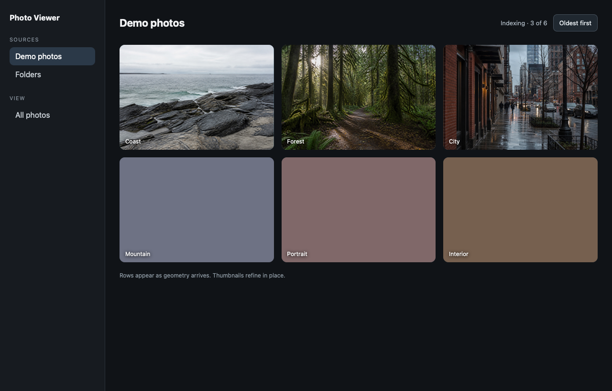
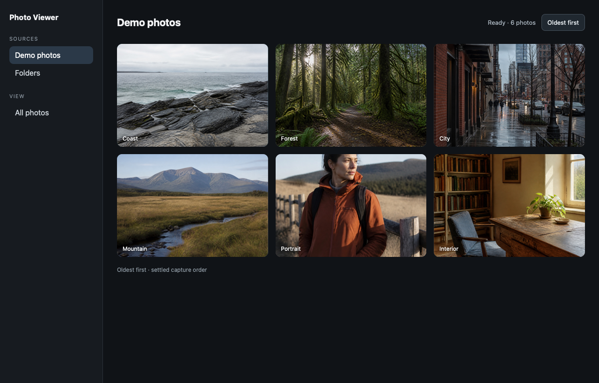

# macOS progressive photo wall verification

Date: 2026-08-26

Implementation commit verified: `318635423ee0fbd6399b8b3ce2ef2a7130198429`
Earlier evidence/documentation commit: `dafd36f` (documentation only)

## Result

The repaired Rust workspace, interface, desktop tests, WebKit suite, full
million-asset catalog benchmark, and unsigned macOS bundle all passed after a
fresh run. The six checked-in JPEG fixtures are unchanged. The earlier native
Tauri attempt launched with the `wall-demo` profile, but this environment could
not drive the native folder picker or capture the display. The screenshots in
this record therefore remain fallback renders made with headless WebKit from
the same six real JPEG fixtures. They show the intended states, but they are not
evidence that the native picker completed.

The final remediation adds safe legacy-catalog upgrades and folder-scoped
offline state, selection-scoped client convergence after rescan or channel lag,
and bounded concurrent derivative generation with exact cache-budget
serialization at the public cache boundary. Independent review and rereview
reported no remaining findings in each remediation batch.

## Task 2: thumbnail-first preview gate and native development profile

Task 2 is implemented on the `codex/progressive-photo-wall` worktree. The
service now keeps one shared, selection-fenced preview gate: recent requested
asset IDs are merged in stable de-duplicated order, a 50 ms quiet period is
debounced through one generation/task, and the task waits for an idle
interaction state, settled scan, zero queued or in-flight derivative work, and
more than the active-interaction background capacity before starting large
previews. Visible wall requests bump the gate generation before their work is
queued and remain scheduler-prioritised. Screen previews remain 4096 px and
non-durable; wall thumbnails remain 1024 px and durable.

The focused RED/GREEN test is
`screen_previews_wait_for_all_overlapping_wall_thumbnail_waves`. The RED run
failed at the active/overlapping-wave assertion when the per-request preview
spawn was restored; the GREEN run passed after the shared gate was installed.
The app-service progressive-wall integration target passed all 25 tests, and
the workspace passed 178 tests across its integration and unit targets.

The standalone desktop manifest contains only:

```toml
[profile.dev.package."*"]
opt-level = 3
```

The root workspace and release profiles were not changed. Cargo cannot select
the `photo-cache` integration target through the standalone desktop manifest
(`photo-cache` is a path dependency and is not a workspace member there), so
the profile-specific evidence is the real desktop-manifest AppService
protocol fixture, which scans a JPEG, generates a wall derivative, and reads
it through the desktop protocol. Its compile-warm run took 0.62 s wall time
(test body 0.05 s); the preceding source-rebuild run took 12.24 s wall time
(11.10 s Cargo build/test setup, 0.05 s test body). For context, the same
cache integration target took 4.30 s wall time in a warm root debug build
(4.19 s test body) and 0.46 s in root release (0.26 s test body). These are
machine observations, not hardware-neutral guarantees.

The final verification commands were all successful:

| Command | Result |
| --- | ---: |
| `cargo test -p photo-app-service --test progressive_wall` | 25 passed |
| `cargo test --workspace --all-features` | 178 passed |
| `cargo clippy --workspace --all-targets --all-features -- -D warnings` | pass |
| `cargo fmt --all -- --check` | pass |
| `cargo test --manifest-path apps/desktop/src-tauri/Cargo.toml` | 9 passed |
| `cargo clippy --manifest-path apps/desktop/src-tauri/Cargo.toml --all-targets -- -D warnings` | pass |
| `cargo fmt --manifest-path apps/desktop/src-tauri/Cargo.toml --all -- --check` | pass |

The controlled source audit remained clean before and after verification:
`git diff --quiet -- apps/interface/public/demo-photos` passed, and no source
fixture path had a status entry. SHA-256 fixture hashes were:

```text
city.jpg     44faf249868e8d3ae81c0b532c460711526fbf17a66b82ee43ac805b3591cad1
coast.jpg    ad6ba90e75709487ab6b927dc3f2781042e31312a4b7bc4606cddd4c0c5c4394
forest.jpg   91c69c673ef96b8afff1c36da486de4dece98fcaeb178310d00b675f2e48a699
interior.jpg c8cc481a50bc60cdfb34e7e6ff2a0ac2e7350dd8f934afae91f3c19b0a2d3a05
mountain.jpg 79bcb7af04b68935b29b5e0a80afb17d1823dde94a5fdbc75e3d5adf7a6e62ae
portrait.jpg d1844a9747c7acfb36b10651ce79acff5c9d35b30a7b54323dbb171aed0bdfd0
```

## Fresh verification

All commands below exited 0.

| Area | Command | Result |
| --- | --- | ---: |
| Rust | `cargo fmt --all --check` | pass |
| Rust | `cargo clippy --workspace --all-targets --all-features -- -D warnings` | pass |
| Rust | `cargo test --workspace --all-features` | 177 tests passed |
| Rust | `cargo test -p catalog-bench --test benchmark_smoke` | 1 test passed |
| Rust | `cargo run -p catalog-bench --release -- --assets 1000000 --output target/catalog-benchmark.json` | 1,000,000 assets completed |
| Interface | `npm run check` | 36 files checked |
| Interface | `npm run typecheck` | pass |
| Interface | `npm test` | 58 tests passed |
| Interface | `npm run test:browser` | 29 tests passed in 2 files |
| Interface | `npm run --workspace @photo-viewer/interface build` | pass, 1,870 modules |
| Desktop | `cargo fmt --manifest-path apps/desktop/src-tauri/Cargo.toml --all --check` | pass |
| Desktop | `cargo clippy --manifest-path apps/desktop/src-tauri/Cargo.toml --all-targets --all-features -- -D warnings` | pass |
| Desktop | `cargo test --manifest-path apps/desktop/src-tauri/Cargo.toml` | 9 tests passed |
| Desktop | `npm run desktop:build -- --bundles app` | unsigned `.app` created |

The browser suite passed in the approved run that permits its loopback test
server. The bundle is at the relative
path `apps/desktop/src-tauri/target/release/bundle/macos/Photo Viewer.app`.

The million-asset report used SQLite 3.53.2 and produced a 645,300,224-byte
database. Insertion took 208,267.27 ms. The first 100-row page took 1.08 ms,
unavailable-asset counting took 125.52 ms, and whole-group eviction planning
took 4.48 ms. These are development-machine observations, not hardware-neutral
guarantees.

## Fallback visual evidence

These assets use the six real files under `apps/interface/public/demo-photos`.
The provisional frame leaves the second row colour-backed while the first row
has thumbnails. The refined frame fills the same geometry with thumbnails. The
GIF switches the direction label from oldest-first to newest-first.






The fallback renderer used the six fixture bytes directly and did not modify
the fixture directory. It does not measure native first-paint or scroll timing.

## Native demonstration attempt

The command `PHOTO_VIEWER_PROFILE=wall-demo npm run desktop:dev` started Vite and
the Tauri desktop binary successfully. The native display capture command
returned `could not create image from display`. AppleScript could enumerate the
desktop process, but querying its window controls returned
`osascript is not allowed assistive access`. Without assistive access, I could
not click the native folder picker, switch sort direction, scroll, or create a
native screenshot or motion capture. I did not rename, delete, or move the
fixture directory to simulate offline mode.

The profile catalog inspection was read-only. It reported zero assets and zero
derivative rows because the picker could not be completed. Consequently,
`wall_thumbnail` and `screen_preview` rows were not available to report for
this native profile. The Rust cache tests still cover both tiers: the workspace
run included 12 cache-policy tests, 5 cache-budget tests, and 8 image-derivative
tests. A native cache-row capture remains an evidence gap for this environment.

First cached-paint and cached screen-preview timings are also not measured for
the same reason. The implementation targets remain 200 ms and 300 ms,
respectively, but this record makes no claim that the native run met them.

## Source read-only audit

The fixture audit ran `git diff --quiet -- apps/interface/public/demo-photos`
and checked that the fixture path had no status entries. Both checks passed.
The six JPEG SHA-1 values after the run were:

```text
city.jpg     23bf9dc7b767d80fa7fc552eb416f144855cc012
coast.jpg    7b1dfde062fbfc52b90a7e9c99b6cfab86e1ab5f
forest.jpg   fe9d20e37728e7ed20c261a44e2834938b8d8c54
interior.jpg d346c4a24dcdce7a2d8a224fe7911a950193c397
mountain.jpg 761f51655c42738085908b8eda813c3d93101090
portrait.jpg d441aa0dbecf293daf33ceb3fa41d6841262edbf
```

The production source path audit found writes confined to managed local state,
cache files, and SQLite. Source reconciliation tests include the explicit
offline-retention check. No production operation writes, renames, or deletes
source media.

## Checkpoint 3 limits

This checkpoint still accumulates mounted rows during a session. Row
virtualization, exact scroll anchoring, continuous row sizing, filename and
rating controls, multi-folder queries, and the immersive viewer remain
deferred to later checkpoints.
